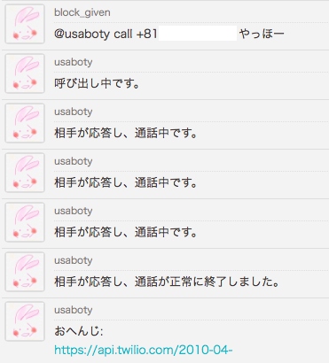

# Ruboty::Call

ruboty plugin for make a call to you.



## Installation

Add this line to your application's Gemfile:

```ruby
gem 'ruboty-call'
```

And then execute:

    $ bundle

Or install it yourself as:

    $ gem install ruboty-call

## Usage

You need to get [Twilio](https://jp.twilio.com/) account and set these environment variables

| env                 | description         |
| ------------------- | ------------------- |
| TWILIO_ACCOUNT_SID  | twilio account sid  |
| TWILIO_AUTH_TOKEN   | twilio auth token   |
| RUBOTY_PHONE_NUMBER | twilio phone number |

then:

    @ruboty call +81xxyyyyzzzz オーケー、ルボティー

    呼び出し中です。
    相手が応答し、通話中です。
    相手が応答し、通話中です。
    相手が応答し、通話中です。
    相手が応答し、通話が正常に終了しました。
    recordings:
    https://api.twilio.com/****-**-**/Accounts/****/Recordings/****.mp3
    https://api.twilio.com/****-**-**/Accounts/****/Recordings/****.mp3

You can set language which ruboty speaks by environment variable. the default language is ja-JP.

    RUBOTY_LANG=en-US bundle exec ruboty

see more available languages from:

https://jp.twilio.com/docs/api/twiml/say#attributes-language

## Contributing

1. Fork it ( https://github.com/blockgiven/ruboty-call/fork )
2. Create your feature branch (`git checkout -b my-new-feature`)
3. Commit your changes (`git commit -am 'Add some feature'`)
4. Push to the branch (`git push origin my-new-feature`)
5. Create a new Pull Request
